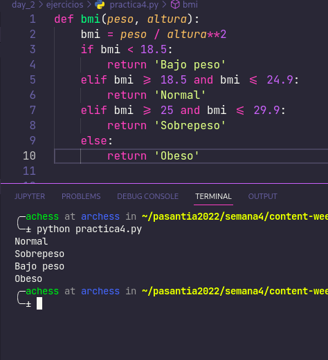

# Ejercicios día 2

## Ejercicio 1

## Ejercicio 2

## Ejercicio 3

## Ejercicio 4

## Ejercicio POO
Con el siguiente enunciado:

Hacer un diagrama de clases para modelar un portafolio de obras de arte. Cada obra tiene un tipo (escultura, pintura, video,…), uno o más autores, una fecha de creación, un valor estimado. Adicionalmente cada obra tiene asociado un conjunto de fotografías y/o videos para exhibirla en el portafolio. A partir del portafolio se crean exposiciones de las obras en galerías. Cada exposición tiene unas fechas, un lugar y una descripción. Para una exposición se selecciona un conjunto de obras el portafolio que se van a presentar.

Entregar:

- El diagrama de clases.
- Codigo de la implementacion en el lenguaje de python.
- No es necesario persistir los datos.
- Capturas del funcionamiento del codigo.

### Diagrama de clases y funcionamiento

